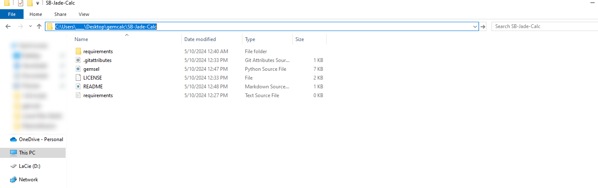

# SB Jade Calc
This project provides a Selenium-based scraper for calculating the potential revenue from selling or crafting gemstones in the game Skyblock. It handles different types of gem calculations including rough, flawed, fine, and flawless gems.


## Prerequisites

Before running the script, you need to install the required Python packages:

```bash
python -m pip install -r requirements.txt

```
### Running 

In order to run the bot you need to 
1. Go to where ever you have the code downloaded and into a folder ex: "C:\Users\___\Desktop\gemcalc\SB-Jade-Calc"
2. Click the location highlighted in the image below

3. In the selected box select all and write 'cmd'
4. Once the terminal opens up paste 'py gemsel.py'
5. The bot should now start running

#### Notes

Currently with the use of selenium it loads the required data on the skyblock.bz website.

